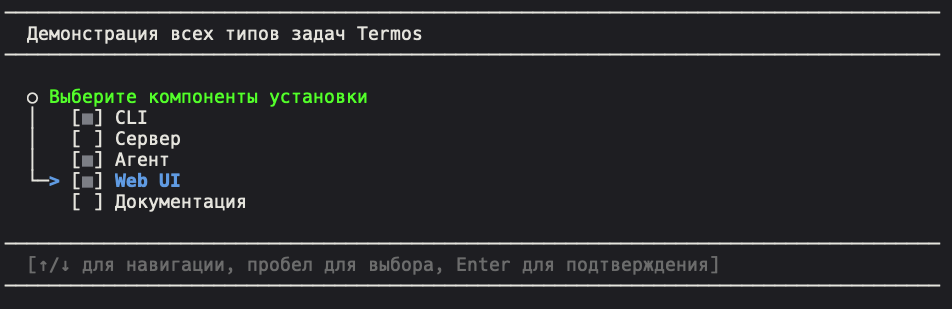
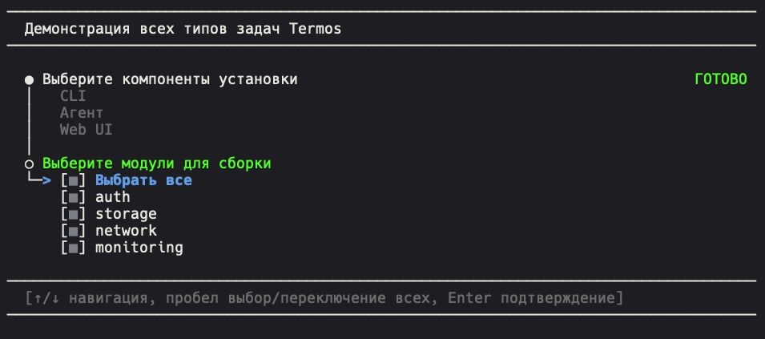
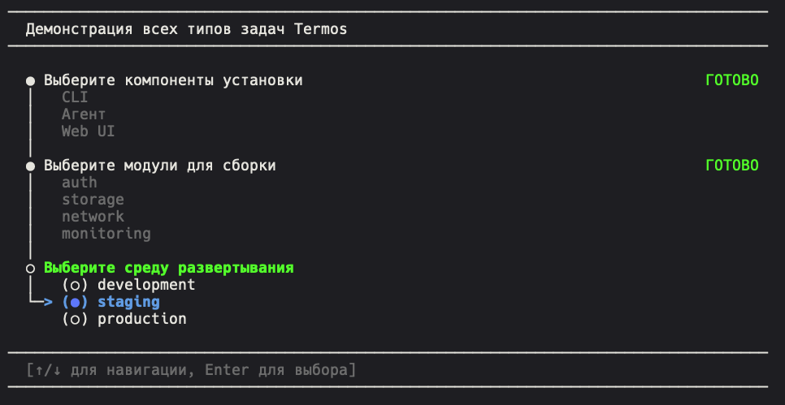
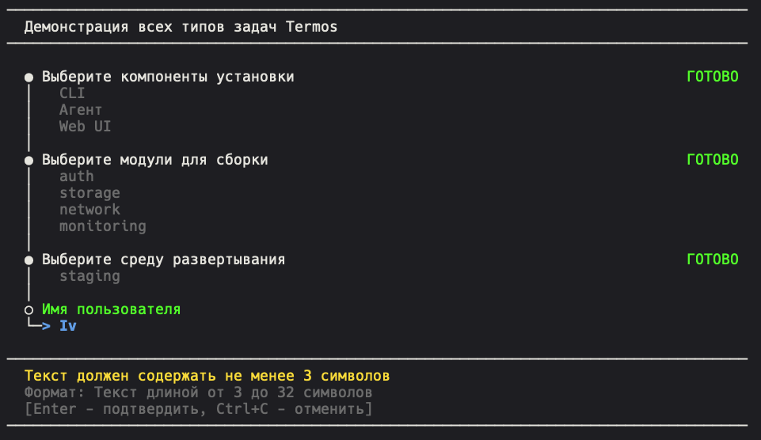
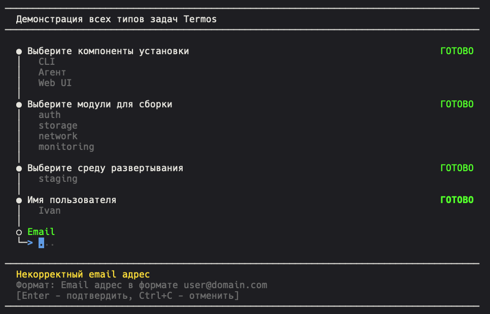

# Терmos (TERMOS) - Terminal Multitask Orchestrator System

**Терmos** - это мощная и гибкая библиотека для создания интерактивных терминальных пользовательских интерфейсов (TUI) на Go. Она построена поверх [Bubble Tea](https://github.com/charmbracelet/bubbletea) и предоставляет высокоуровневые компоненты для создания консольных приложений с богатой функциональностью.

## ✨ Особенности

- 🎯 **Готовые компоненты** - задачи выбора Да/Нет, одиночного и множественного выбора, ввода текста, выполнения функций
- 🎨 **Гибкая стилизация** - поддержка цветов, стилей и тем оформления
- 📱 **Адаптивность** - оптимизация для embedded устройств с ограниченными ресурсами
- 🔄 **Очереди задач** - система управления последовательностью задач с автоматическим выполнением
- ✅ **Валидация** - встроенная система валидации пользовательского ввода (email, пароли, IP, домены и др.)
- ⏱️ **Таймауты** - поддержка автоматических таймаутов с значениями по умолчанию
- 🎭 **Анимации** - поддержка анимированных переходов и спиннеров
- 🧠 **Умная память** - оптимизация использования памяти для встроенных систем
- 🚀 **Простой API** - удобный публичный API для быстрой интеграции

## 🚀 Быстрый старт



### Установка

```bash
go get github.com/qzeleza/termos
```

### Простой пример

```go
package main

import (
	"log"
	"time"

	"github.com/qzeleza/termos"
)

func main() {
	// Создаем новую очередь задач
	queue := termos.NewQueue("Простой пример").
		WithAppName("Мое приложение").
		WithSummary(true)

	// Создаем задачу подтверждения
	confirm := termos.NewYesNoTask("Подтверждение", "Хотите продолжить?").
		WithTimeout(10*time.Second, "Да")

	// Создаем задачу выбора среды
	env := termos.NewSingleSelectTask("Выбор среды", []string{
		"development", "staging", "production",
	}).WithTimeout(10*time.Second, "development")

	// Добавляем задачи и запускаем
	queue.AddTasks(confirm, env)
	if err := queue.Run(); err != nil {
		log.Fatal(err)
	}
}
```

## 📚 Типы задач

### 🔘 Задача выбора Да/Нет (YesNoTask)

```go
confirm := termos.NewYesNoTask("Подтверждение", "Сохранить изменения?").
	WithTimeout(5*time.Second, "Нет").
	WithCustomLabels("Согласен", "Отказаться")

// Получение результата
if confirm.IsYes() {
	// пользователь выбрал "Да"
}
```

### 📝 Одиночный выбор (SingleSelectTask)

```go
env := termos.NewSingleSelectTask("Выбор среды", []string{
	"development", "staging", "production",
}).WithTimeout(10*time.Second, "development")

// Получение результата
selected := env.GetSelected() // возвращает выбранную строку
index := env.GetSelectedIndex() // возвращает индекс
```

### ☑️ Множественный выбор (MultiSelectTask)

```go
components := termos.NewMultiSelectTask("Выбор компонентов", []string{
	"API", "Database", "Cache", "Monitoring",
}).WithSelectAll("Выбрать все").
	WithTimeout(15*time.Second, []string{"API", "Database"})

// Получение результата
selected := components.GetSelected() // возвращает []string
```

### 📝 Ввод текста (InputTask)

```go
v := termos.DefaultValidators

email := termos.NewInputTask("Email", "Введите email:").
	WithInputType(termos.InputTypeEmail).
	WithValidator(v.Email()).
	WithTimeout(20*time.Second, "user@example.com")

// Получение результата
value := email.GetValue()
```

### ⚙️ Выполнение функции (FuncTask)

```go
deploy := termos.NewFuncTaskWithOptions("Развертывание",
	func() error {
		// Выполнение работы
		time.Sleep(2 * time.Second)
		return nil
	},
	termos.WithSummaryFunction(func() []string {
		return []string{
			"Сервисы запущены: 3",
			"Время: 2.1с",
		}
	}),
	termos.WithStopOnError(false),
)
```

## ✅ Валидаторы

Терmos включает богатую коллекцию валидаторов:

```go
v := termos.DefaultValidators

// Основные валидаторы
v.Required()           // Обязательное поле
v.Email()              // Email адрес
v.OptionalEmail()      // Опциональный email
v.URL()                // HTTP/HTTPS URL
v.Path()               // Путь к файлу/директории
v.Port()               // Порт (1-65535)
v.Username()           // Имя пользователя
v.AlphaNumeric()       // Только буквы и цифры

// IP адреса
v.IP()                 // Любой IP (IPv4 или IPv6)
v.IPv4()               // IPv4 адрес
v.IPv6()               // IPv6 адрес
v.Domain()             // Доменное имя

// Длина строки
v.MinLength(5)         // Минимальная длина
v.MaxLength(10)        // Максимальная длина
v.Length(8)            // Точная длина
v.Range(10, 100)       // Число в диапазоне

// Пароли
v.StandardPassword()   // Стандартный пароль (>=8 символов)
v.StrongPassword()     // Сильный пароль (>=12, с требованиями)
```

## 🔧 Дополнительные возможности

### Таймауты

Все задачи поддерживают автоматические таймауты:

```go
// Автоматический выбор "Да" через 10 секунд
confirm := termos.NewYesNoTask("Подтверждение", "Продолжить?").
	WithTimeout(10*time.Second, "Да")

// Автоматический выбор первого элемента через 15 секунд
select := termos.NewSingleSelectTask("Выбор", options).
	WithTimeout(15*time.Second, 0) // или "имя_элемента"

// Автоматический ввод значения по умолчанию
input := termos.NewInputTask("Ввод", "Значение:").
	WithTimeout(10*time.Second, "default")
```

### Настройка очереди

```go
queue := termos.NewQueue("Заголовок").
	WithAppName("Мое приложение").    // Название в заголовке
	WithSummary(true)                 // Показать сводку по завершению
```

## 📁 Примеры

В директории `examples/api/` вы найдете готовые примеры:

- `simple_example.go` - Базовый пример со всеми типами задач
- `validation_example.go` - Демонстрация всех валидаторов

Чтобы запустить пример:

```bash
cd examples/api
go run simple_example.go
```

## 🖼️ Скриншоты

Ниже приведены скриншоты, демонстрирующие работу интерфейса Термос:









## 📦 Компоненты

### Задачи (Tasks)

- **YesNoTask** - выбор "да/нет" (только 2 опции)
- **SingleSelectTask** - выбор одного элемента из списка
- **MultiSelectTask** - выбор нескольких элементов из списка  
- **InputTaskNew** - ввод текста с валидацией

### Очереди (планируется)

- Оркестрация последовательных задач и сбор статистики в пакете `query/` (в разработке)

### UI компоненты

- **Styles** - система стилизации
- **Colors** - управление цветовой схемой
- **Layout** - компоненты разметки

## 🎨 Кастомизация

### Стили

```go
import "github.com/qzeleza/termos/ui"

// Настройка пользовательских стилей
styles := ui.GetDefaultStyles()
styles.Title = styles.Title.Foreground(lipgloss.Color("#ff6b6b"))
styles.Selected = styles.Selected.Background(lipgloss.Color("#4ecdc4"))
```


### Нумерация задач в очереди

`WithTasksNumbered(enable, keepFirstSymbol, format)` позволяет заменить стандартные маркеры `○/●` на числовую нумерацию.

```go
queue := termos.NewQueue("CI Pipeline").
    WithAppName("Termos").
    WithSummary(true).
    // Используем квадратные скобки и лидирующие нули: [01], [02], ...
    WithTasksNumbered(true, false, "[%02d]")

queue.AddTasks(buildTask, testTask, deployTask)

if err := queue.Run(); err != nil {
    log.Fatal(err)
}

// Оставляем первый маркер без номера и переходим на круглые скобки
queue.WithTasksNumbered(true, true, "(%d)")
```

- `enable` — включает нумерацию.
- `keepFirstSymbol` — сохранит `○/●` для первой задачи (остальные будут пронумерованы).
- `format` — любой шаблон `fmt.Sprintf`, например `"(%02d)"`, `"[0%d]"`.

### Локализация и требования к терминалу

- Язык интерфейса задаётся флагом `--lang` или переменной окружения `TERMOS_LANG` (`ru`, `en`, `tr`, `be`, `uk`).
- Библиотечный API даёт возможность установить язык по умолчанию: `termos.SetDefaultLanguage("tr")`.
- Если запрошена русская локаль, Termos проверяет `ru_RU.UTF-8`; при отсутствии локали интерфейс переключается на английский и выводит инструкцию по установке.
- Базовые команды для развертывания локали:
  - Debian/Ubuntu: `sudo locale-gen ru_RU.UTF-8 && sudo update-locale LANG=ru_RU.UTF-8`
  - Entware/BusyBox: `opkg install locale-full glibc-binary-locales && export LANG=ru_RU.UTF-8`
- Для корректного отображения псевдографики убедитесь, что терминал работает в UTF-8 и экспортирует `COLORTERM`.
- На консольных терминалах (Linux console, BusyBox) настроьте шрифты: `setterm -reset && setterm -store && setterm -font latarcyrheb-sun32`.


### Embedded оптимизации

```go
// 1) Ограничивайте ширину рендера
import "github.com/qzeleza/termos/common"
w := common.CalculateLayoutWidth(terminalWidth)

// 2) Переиспользуйте стили вместо пересоздания в каждом кадре
import "github.com/qzeleza/termos/ui"
ui.TitleStyle = ui.TitleStyle.Foreground(ui.ColorBrightGreen)

// 3) Используйте пулы для сборки строк
import "github.com/qzeleza/termos/performance"
b := performance.GetBuffer()
defer performance.PutBuffer(b)
b.WriteString("...быстрая сборка строки...")
```

> Примечание: оптимизации для embedded теперь включаются автоматически при импортировании модуля (внутренний пакет `internal/autoconfig`). Ручные примеры из каталога `examples/` можно использовать как демонстрацию, но базовая адаптация применяется по умолчанию.

Переменные окружения для управления автодетекцией:

- `TERMOS_EMBEDDED` — принудительное включение/выключение (`true`/`1` или пусто/`0`).
- `TERMOS_MEMORY_LIMIT` — порог памяти для эвристики (например: `64MB`, `128KB`, `1GB`).
- `TERMOS_ASCII_ONLY` — форсировать ASCII-режим (`true`).

## 📚 Документация

- [Руководство разработчика](docs/DEVDOC.md)
- [Примеры использования](docs/EXAMPLES.md)
- [Горячие клавиши](docs/HOTKEYS.md)
- [Настройка стилей](docs/STYLING.md)
- [Оптимизация для embedded](docs/EMBEDDED_OPTIMIZATION_REPORT.md)
- [Решение проблем](docs/TROUBLESHOOTING.md)

## 🏗️ Архитектура

```
termos/
├── task/           # Основные компоненты задач
├── query/          # Система очередей
├── ui/             # UI компоненты и стили  
├── validation/     # Система валидации
├── performance/    # Оптимизации производительности
├── common/         # Общие утилиты
├── errors/         # Обработка ошибок
└── docs/           # Документация
```

## 🎯 Применение

Термос идеально подходит для:

- **CLI утилиты** - интерактивные консольные приложения
- **Инсталляторы** - пошаговые установщики и настройщики
- **Системные утилиты** - управление конфигурациями и сервисами
- **Embedded устройства** - роутеры, IoT устройства с ограниченными ресурсами
- **DevOps инструменты** - развертывание и мониторинг

## 🤝 Совместимость

- **Go версия:** 1.22+
- **Платформы:** Linux, macOS, Windows
- **Терминалы:** все современные терминалы с поддержкой ANSI
- **Embedded:** OpenWrt, Entware, роутеры с ≥32MB RAM

## 📊 Производительность

- **Память:** оптимизировано для работы с ≥16MB RAM
- **CPU:** эффективная работа на ARM, MIPS, x86 архитектурах
- **Анимации:** адаптивная частота кадров в зависимости от мощности системы

## 🐛 Отчеты об ошибках

Если вы нашли ошибку или хотите предложить улучшение:

1. Проверьте [существующие issue](https://github.com/qzeleza/termos/issues)
2. Создайте новый issue с подробным описанием
3. Приложите минимальный пример воспроизведения

## 📄 Лицензия

MIT License - см. файл [LICENSE](LICENSE) для подробностей.

## 🙏 Благодарности

- [Bubble Tea](https://github.com/charmbracelet/bubbletea) - основа для TUI
- [Lip Gloss](https://github.com/charmbracelet/lipgloss) - стилизация
- Сообщество Go разработчиков

---

**Создано с ❤️ для сообщества Go разработчиков**
